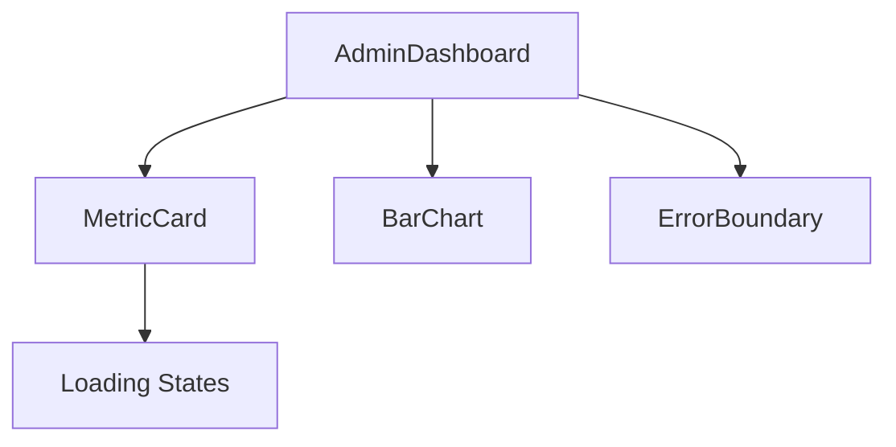

# PSA Nashik App - Project Documentation

## Phase 7: Admin Dashboard (Completed)
### Technical Architecture
```typescript
interface DashboardMetrics {
  totalUsers: number;
  activeUsers: number;
  revenue?: {
    currentMonth: number;
    previousMonth: number;
  };
  attendanceTrend: number[];
}
```

### Implementation Details
- **Components**:
  - `MetricCard`: 
    - Props: `title, value, icon, trend, loading`
    - Features: Skeleton loading, trend indicators
  - `BarChart`:
    - Props: `data: {labels[], values[]}, title`
    - Libraries: Chart.js
  - `ErrorBoundary`:
    - Fallback UI with error recovery
    - Logs errors to console

- **Key Features**:
  - JWT Authentication via Firebase
  - Role-based route protection
  - Responsive grid layout (mobile-first)
  - API error handling
  - Loading state management

### Code Structure
```
/src
  /components
    MetricCard.tsx
    BarChart.tsx
    ErrorBoundary.tsx
  /pages
    AdminDashboard.tsx
    Login.tsx
  /context
    AuthContext.tsx
```

### Technical Specifications


## Phase 8: Notification System (Upcoming)
### Planned Features
- Email/SMS notifications
- User preference management
- Notification history

## Development Setup
```bash
npm install
npm run dev
```

## Deployment Guide
1. Set environment variables in Vercel
2. Whitelist domains in Firebase
3. Configure CI/CD pipeline
