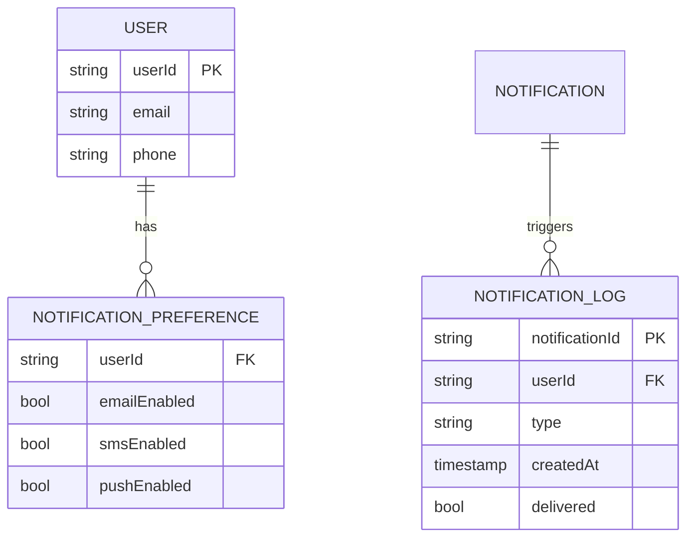

# Notification System Architecture (Phase 8)

## Core Components
1. **Notification Types**:
   - Email (SMTP/Nodemailer)
   - SMS (Twilio)
   - In-App (Firebase Cloud Messaging)

2. **Database Schema**:

## Implementation Plan
1. **Backend Services**:
   - Notification dispatcher service
   - Preference management API
   - Delivery status webhook

2. **Frontend Components**:
   - Notification center UI
   - Preference settings panel
   - Real-time updates via WebSocket

## Tech Stack
- **Backend**: Node.js + Express
- **Database**: Firebase Realtime Database
- **Frontend**: React Context + Custom Hooks
